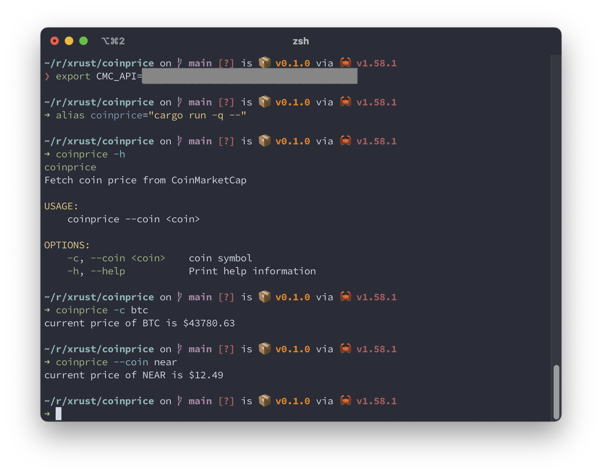

## coinprice
An CLI app to fetch price of a coin from [CoinMarketCap](https://coinmarketcap.com)

## usage
```
$ export CMC_API=<your_cmc_api>
$ cargo run -q -- -coin <coin_symbol>
```

## screenshot

