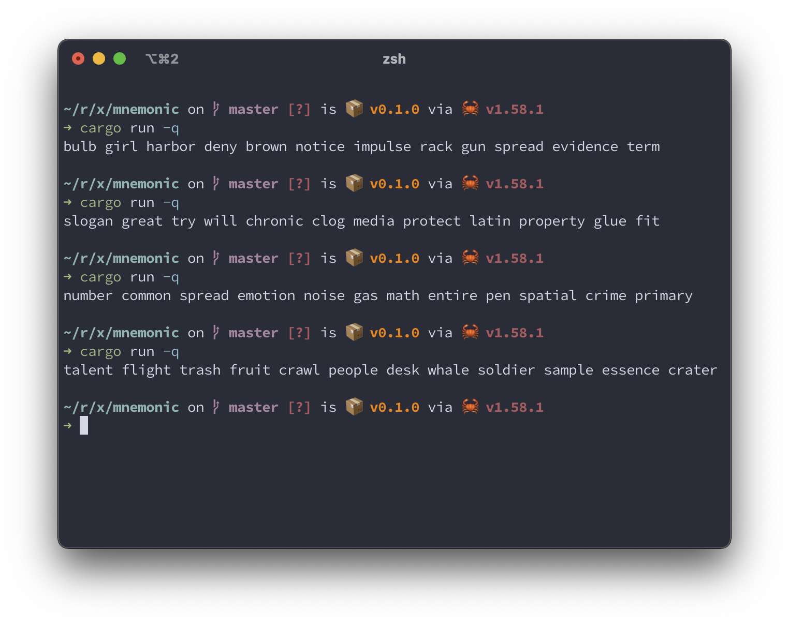

## Mnemonic

A CLI app to generate a seed phrase that satisfyies the [BIP39](https://github.com/bitcoin/bips/blob/master/bip-0039.mediawiki) specification.

## How to use

`$ cargo run -q`

Copy generated seed phrase to clipboard in MacOS

`$ cargo run -q | pbcopy`

## Screenshot

